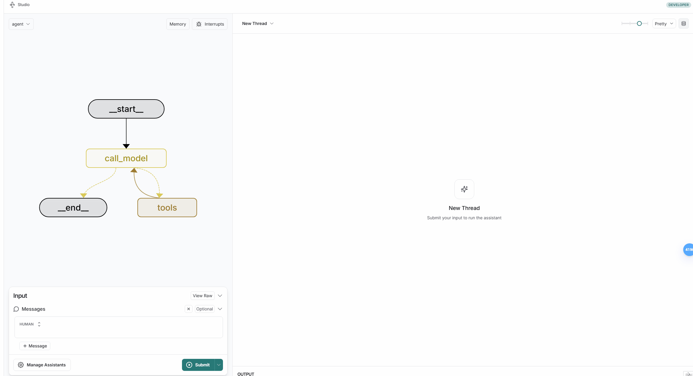
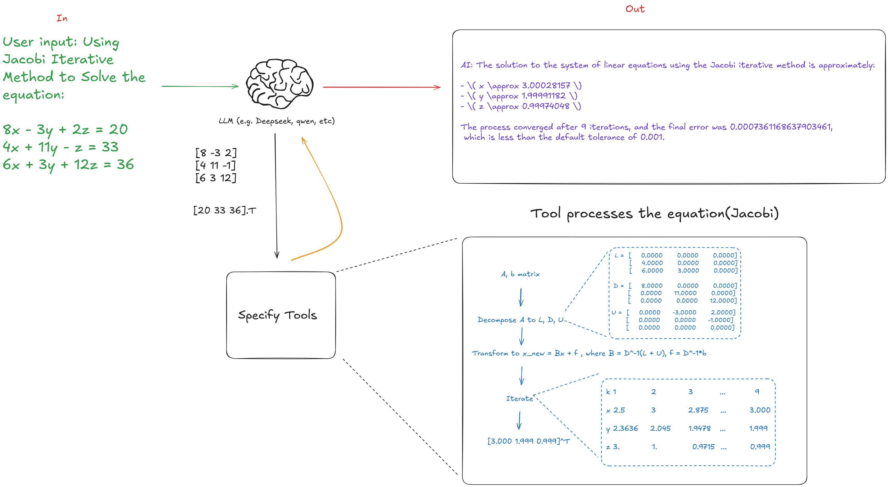
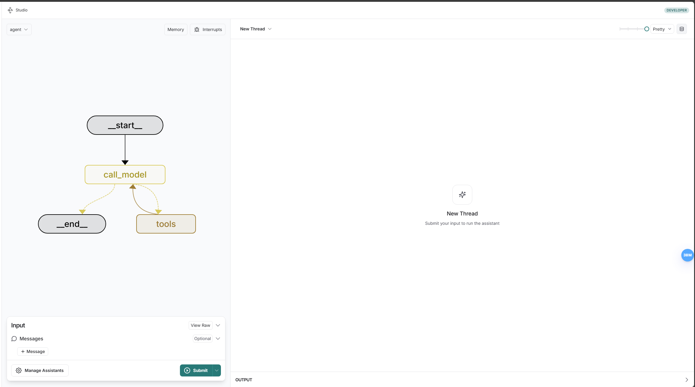

# JGSSolver（Jacobi-Gauss-Seidel Solver）
[English](../readme.md) | [简体中文](readme_zh.md)

一个使用 Jacobi、Gauss-Seidel 以及 SOR 方法求解线性方程组的Agent。  
比其他 LLM 更快地求解线性方程组，让你无需编程知识就能用自然语言解决问题。





---

## 🚀 快速开始

本指南帮助你使用 Docker Compose 快速设置并运行项目。  
无需手动安装依赖，只需按照以下步骤操作！

---

## 1️⃣ 克隆该仓库

从 GitHub 下载项目：
```bash
git clone https://github.com/wexhi/linear_solver_agent.git
cd linear_solver_agent
```


---

## 2️⃣ 配置 API 密钥

你需要从 [Dashscope](https://help.aliyun.com/zh/model-studio/developer-reference/get-api-key?spm=a2c4g.11186623.0.0.74b04823ga7w7T) 和 [Langsmith](https://docs.smith.langchain.com/administration/how_to_guides/organization_management/create_account_api_key) 获取 API 密钥才能运行该项目。

### 步骤：
1. 复制 `.env.template` 文件为 `.env`
    ```bash
    cp .env.template .env
    ```
2. 打开 .env 文件并添加你的 API 密钥
    ```bash
    nano .env
    ```
3. 填写你的 API 密钥：
    ```bash
    DASHSCOPE_API_KEY=your_dashscope_key # 阿里云 Dashscope API 密钥
    LANGSMITH_API_KEY=your_langsmith_key # Langsmith API 密钥
    OPENAI_API_BASE=https://dashscope.aliyuncs.com/compatible-mode/v1
    PORT=2025
    ```

---

## 3️⃣ 安装 Docker & Docker Compose

确保你的设备已经安装了 Docker 和 Docker Compose。

* **Windows/macOS**: 下载 Docker Desktop
* **Linux**: 通过包管理器安装：

```bash
sudo apt update && sudo apt install docker.io docker-compose -y
```

验证安装：
```bash
docker --version
```

##　4️⃣ 构建并运行项目
使用以下命令构建并运行项目：
```bash
docker-compose up --build
```
如果下载镜像或依赖失败，请尝试为 Docker 设置加速器后重试。

项目启动后，你可以在 https://smith.langchain.com/studio/?baseUrl=http://localhost:2025 访问。

## 🎯 完成！你的应用已启动！
现在，你可以在以下地址访问它： 👉 https://smith.langchain.com/studio/?baseUrl=http://localhost:2025 （根据你在 .env 里配置的端口）

如果一切正常，你会看到如下界面：

你可以给Agent发送消息，它会为你求解线性方程组。🤗