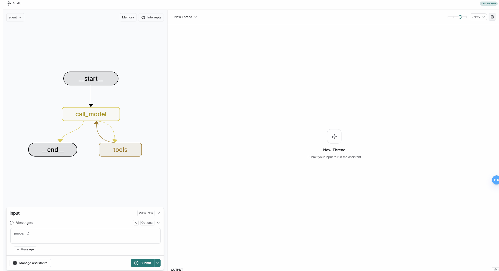
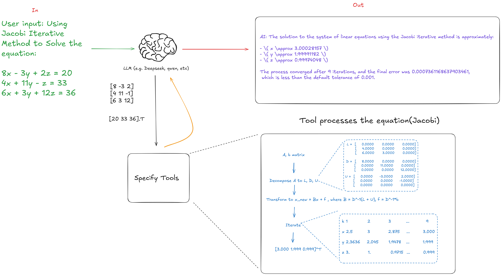

# JGSSolver（Jacobi-Gauss-Seidel Solver）

A agent for solving linear equations that uses Jacobi, Gauss-Seidel method and SOR method.Faster than any other LLMs in solving linear equations.It allows you to solve linear equations with natural language without any programming knowledge.





# 🚀 Quickstart
This guide helps you set up and run the project quickly using Docker Compose.
No manual dependency installation—just follow these simple steps!
## 1️⃣ Configure Your API Keys

You need to get API keys from [Dashscope](https://help.aliyun.com/zh/model-studio/developer-reference/get-api-key?spm=a2c4g.11186623.0.0.74b04823ga7w7T) and [Langsmith](https://docs.smith.langchain.com/administration/how_to_guides/organization_management/create_account_api_key) to run the project.

1. Copy '.env.template' to '.env'. 
```bash
cp .env.template .env
```
2. Open the '.env' file and add your API keys.
```bash
# .env
nano .env
```
3.Fill in your API keys:
```bash
DASHSCOPE_API_KEY=your_dashscope_key # Aliyun Dashscope API key
LANGSMITH_API_KEY=your_langsmith_key # Langsmith API key
OPENAI_API_BASE=https://dashscope.aliyuncs.com/compatible-mode/v1
PORT=2025
```

## 2️⃣ Clone This Repository

Download the project from GitHub:
```bash
git clone https://github.com/wexhi/linear_solver_agent.git
cd linear_solver_agent
```

## 3️⃣Install Docker & Docker Compose

Ensure Docker and Docker Compose are installed.

* **Windows/macOS**: Download [Docker Desktop](https://www.docker.com/get-started/)
* **Linux**: Install via package manager:
```bash
sudo apt update && sudo apt install docker.io docker-compose -y
```
Verify installation:
```bash
docker --version
docker-compose --version
```

## 4️⃣ Build & Run the Project
Now, build and run everything with:
```bash
docker-compose up --build
```
It might fail when downloading the image or requirements. If so, please try to set registry mirror for docker and try again.

The project will start running on `https://smith.langchain.com/studio/?baseUrl=http://localhost:2025`.

## 🎯 Done! Your application is running!
Now, you can access it at:
👉 https://smith.langchain.com/studio/?baseUrl=http://localhost:2025 (or the port you configured in .env)

here is what you will see if everything is working fine: 


you can add a message to the agent and it will solve the linear equations for you.🤗

📌 TODO:
- [ ] Add more model to the agent. (currently only support qwen-max or qwen-plus)
- [ ] Add more solvers to the agent.
